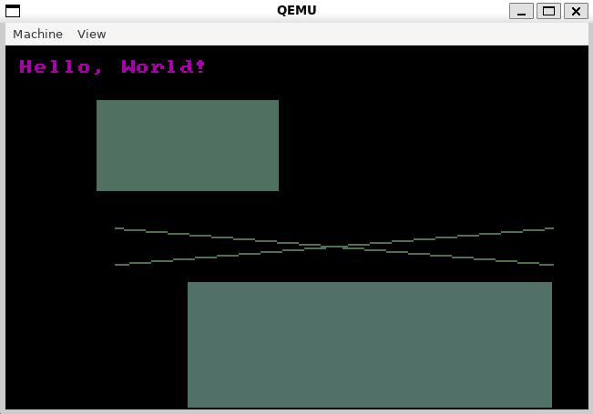

# Description


This program makes use of the 512 byte boot sector and BIOS interrupts to render
basic shapes on a 640x480 16 color VGA display.
The example contains flashing lights.

# Build Instructions

## Prerequisites
  - [fasm](https://flatassembler.net/)
  - qemu:
    ```console
      $ sudo apt install qemu-system #Debian
    ```

## Instructions
```console
  $ ./run.sh
```
